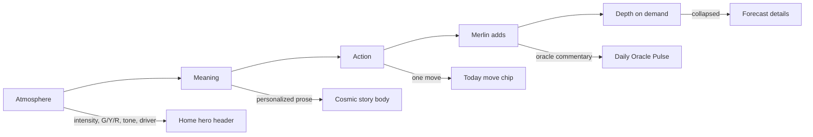
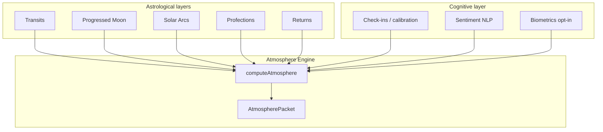

# Merlin Atmosphere Engine — Development Roadmap

**Last updated:** 2026-06-24  
**Horizon:** ~20 weeks (MVP ~5 weeks, predictive depth ~7 weeks, cognitive layer ~8 weeks)  
**Status:** Phase 0 complete — ready to implement

---

## 1. Executive summary

The **Atmosphere Engine** is Merlin’s unified **Beat 1** in the Daily Briefing Loop. It answers one question with one contract:

> *What does today’s sky feel like for my chart — and why?*

It replaces scattered intensity/headline logic across `page.tsx`, `CosmicStoryCard`, and orphaned `CosmicWeatherWidget` with a single **`AtmospherePacket`** consumed by Home, wheel Forecast, Oracle, and (later) desktop/local AI runtimes.

Long-term, it becomes **Cognitive Atmosphere Forecasting**: astrological time layers (transits → progressions → solar arcs → time-lords) plus optional reality-check inputs (check-ins, sentiment, biometrics) composed into actionable guidance.

---

## 2. Problem statement

### 2.1 Fragmentation today

| Source | Owns | Problem |
|--------|------|---------|
| `lib/dashboard/cosmic-rating.ts` | G/Y/R badges, intensity map | Canonical but not always used |
| `CosmicStoryCard` + `CosmicWeatherWidget` | Tone labels, gradients, icons | **Duplicated** `weatherTone()` / `ratingToIntensity()` |
| `app/dashboard/page.tsx` | `cosmicWeatherIntensity`, headline, today’s move | **Ad-hoc priority chain** (storms → forecast → pressure) |
| `lib/astrology/ephemeris.ts` → `buildSummary()` | Story prose opening | Template-based; can contradict tone/rating |
| `useForecast` + `usePressureWindow` + `useStorms` | Separate fetches | No single atmosphere contract |

### 2.2 UX goal (Daily Briefing Loop)



**Home** is the reference implementation. Chart, Relationships, and legacy sections still use equal-weight data dumps — atmosphere unification sets the pattern.

---

## 3. Vision: layered time + reality check

From *Beyond Transits* — professional forecasting uses **confluence**, not single techniques:

| Layer | Technique | Question | Merlin phase |
|-------|-----------|----------|--------------|
| **Era** | Zodiacal Releasing | What life chapter? | Deferred → Life Arc v2 |
| **Year** | Annual Profections + Solar Return | Theme + time lord this year? | Phase 6 |
| **Season** | Secondary Progressions | Internal emotional climate? | MVP v0.5 (progressed Moon) |
| **Window** | Solar Arc Directions | When do major events land? | Phase 6 |
| **Trigger** | Transits + Lunar timing | What fires today/this week? | MVP (primary) |
| **Reality** | Check-ins, sentiment, biometrics | How equipped am I right now? | MVP lite → Phase 7 |



**Triple Hit rule (target):** When a transit hits a point already activated by progression, solar arc, or profection lord → amplify intensity and confidence. MVP ships **Triple Hit v0.5** (transit + progressed Moon + lunar confluence flag).

---

## 4. Gap analysis (codebase audit)

| Capability | In docs | Merlin today | Gap |
|------------|---------|--------------|-----|
| Transits / pressure | ✓ | `pressure-engine`, `predictive-transits` | Wire to unified packet |
| Progressed Moon | ✓ | `progressions.ts`, `predictive-transits` | Expose as `baselineTemperature` |
| Confluence (partial) | ✓ | `confluence-detector.ts` (transit + lunar + progressed-moon) | Extend sources in Phase 6 |
| Storms override | ✓ | `storms.ts`, page memos | Formalize in `intensity.ts` |
| Calibration / learning | ✓ | `feedback/calibration.ts`, resonance DB | Surface in `provenance` |
| Life timeline | ✓ | `life-arc.ts` | Not tied to daily atmosphere |
| MBTI lens | ✓ | `dual-overlay`, forecast overlay | Atmosphere tint line only in MVP |
| Solar Arc Directions | ✓ | — | **Build** Phase 6 |
| Annual Profections | ✓ | — | **Build** Phase 6 |
| Zodiacal Releasing | ✓ | — | Deferred |
| Solar / Lunar Returns | ✓ | — | Phase 6b |
| Journal sentiment NLP | ✓ | — | Phase 7 |
| Biometrics / calendar | ✓ | — | Deferred |
| Unified atmosphere UI | ✓ | `CosmicStoryCard` partial; `CosmicWeatherWidget` unused | **Unify** Phase 3 |
| Modular API contract | ✓ | Scattered hooks | **`/api/atmosphere`** Phase 2 |

### Key files to touch

| File | Role |
|------|------|
| `app/dashboard/page.tsx` | Remove `cosmicWeatherIntensity` / `cosmicWeatherHeadline` memos |
| `components/dashboard/CosmicStoryCard.tsx` | Extract header → `AtmosphereHeader` |
| `components/dashboard/CosmicWeatherWidget.tsx` | Deprecate / delete after unification |
| `components/dashboard/panels/HomeTabPanel.tsx` | Consumer |
| `components/dashboard/WheelTransitPanel.tsx` | Compact atmosphere strip |
| `lib/dashboard/cosmic-rating.ts` | Keep as G/Y/R presentation source |
| `lib/astrology/predictive-transits.ts` | Progressed Moon, lunar timing inputs |
| `lib/astrology/confluence-detector.ts` | Triple-hit alignment |
| `lib/astrology/pressure-engine/` | Primary intensity + top driver |
| `lib/safety/copy-safety.ts` | Rationale string lint |

---

## 5. MVP scope

### 5.1 In scope (Weeks 1–5)

| Pillar | Deliverable |
|--------|-------------|
| **Personal Forecasting** | `AtmospherePacket`: intensity 0–100, `dayRating` (green/yellow/red), tone label, dominant driver, lunar context, confidence, provenance |
| **Interpretation Engine** | Safe rationale prose; MBTI optional tint; no deterministic event language |
| **Dashboard Experience** | Home hero unified; wheel Forecast strip; Brief → Depth unchanged |
| **Memory lite** | Calibration modifiers in provenance after 3+ check-ins; thumbs feedback on story |

**Astrology depth (MVP):** Transits (primary) + storms override + progressed Moon baseline modifier + confluence boolean.

### 5.2 Out of scope (MVP)

- LLM-generated atmosphere prose
- Per-domain atmosphere (separate career vs relationship sky)
- WebGL / animated sky backgrounds
- Push notifications
- New top-level nav tab
- Collective social mood

### 5.3 Deferred (post-MVP)

| Item | Phase |
|------|-------|
| Solar Arc Directions | 6 |
| Annual Profections | 6 |
| Solar / Lunar Returns | 6b |
| Zodiacal Releasing | Life Arc v2 |
| Journal sentiment NLP | 7 |
| Vector memory / pattern store | 7 |
| Local AI routing (Ollama/OpenRouter) | 7 |
| Biometrics (Oura, Apple Health) | 8+ |
| Calendar / workload integration | 8+ |

---

## 6. Data contract

### 6.1 `AtmospherePacket` (MVP)

```ts
// lib/atmosphere/types.ts — canonical boundary for web, API, future desktop

export type DayRating = 'green' | 'yellow' | 'red';

export type AtmosphereToneLabel =
  | 'Storm Watch'
  | 'Caution'
  | 'Mixed Skies'
  | 'Smooth Flow';

export interface AtmosphereTone {
  label: AtmosphereToneLabel;
  icon: 'storm' | 'rain' | 'mixed' | 'clear';
  gradient: string;   // tailwind gradient key
  border: string;
  text: string;
}

export interface AtmosphereDriver {
  label: string;      // e.g. "Mars square natal Moon"
  rationale: string;  // one safe sentence for "Why"
  source: 'pressure' | 'storm' | 'transit' | 'confluence' | 'fallback';
}

export interface AtmosphereConfluence {
  aligned: boolean;
  themes: string[];
  signalCount: number;
}

export interface AtmosphereTemporalContext {
  progressedMoonSign?: string;
  progressedMoonDegree?: number;
  baselineTemperature: 'cool' | 'neutral' | 'warm' | 'hot'; // dampens/amplifies
  lunarPhase?: string;
  lunarSign?: string;
}

export interface AtmosphereCalibration {
  active: boolean;
  feedbackCount: number;
  strongestPlanet?: string;
  strongestMultiplier?: number;
}

export interface AtmospherePacket {
  date: string;                    // YYYY-MM-DD
  intensity: number;               // 0–100
  dayRating: DayRating;
  tone: AtmosphereTone;
  dominantDriver: AtmosphereDriver;
  temporal: AtmosphereTemporalContext;
  confluence: AtmosphereConfluence;
  calibration?: AtmosphereCalibration;
  confidence: number;              // 0–100
  provenance: string[];            // e.g. ['pressure-engine', 'progressed-moon', 'storms']
  generatedAt: string;           // ISO
}
```

### 6.2 Intensity priority chain (signed off for MVP)

1. **Pressure-engine** `globalPressure` / top predictive event intensity (when available)
2. **Storms** top storm `intensityScore` or severity tier (override when active storm)
3. **Forecast** `day_rating` → `ratingToIntensity` from `cosmic-rating.ts`
4. **Fallback** 55 (neutral)

Apply **progressed Moon modifier** after base intensity:

- Challenging progressed Moon sign/aspect → `×1.1` (cap 100)
- Supportive → `×0.95` (floor 15)

### 6.3 Modular integration contract

- **HTTP:** `POST /api/atmosphere` → `{ success, data: AtmospherePacket }`
- **Hook:** `useAtmosphere({ birthData, mbtiType?, userId?, date? })`
- **Events (analytics):** `atmosphere_rendered`, `atmosphere_source_*`
- **Consumers:** `HomeTabPanel`, `WheelTransitPanel`, Oracle context builder, future Electron shell

---

## 7. Phased delivery

### Phase 0 — Alignment ✅

- [x] Review UX audit + Beyond Transits + next_steps docs
- [x] Codebase gap analysis
- [x] Roadmap + TODO documents
- [ ] Team sign-off on `AtmospherePacket` schema and intensity chain

**Duration:** 3 days

---

### Phase 1 — Engine core (Week 1)

**Goal:** Server-side `computeAtmosphere()` with tests. No UI changes.

| Task | Output |
|------|--------|
| Create `lib/atmosphere/` module | `types.ts`, `intensity.ts`, `tone.ts`, `headline.ts`, `compute.ts`, `index.ts` |
| Wire pressure-engine top driver | From `ExplainabilityPacket` / predictive events |
| Wire storms fallback | From `stormsReport` |
| Wire progressed Moon modifier | From `predictive-transits` |
| Confluence v0.5 | Delegate to `confluence-detector.ts` |
| Copy-safety on rationale | `lib/safety/copy-safety.ts` |
| Unit tests | Green/yellow/red paths, storm override, progressed boost, Norfolk fixture |

**Acceptance:**

- Same chart + date → identical packet
- No blocked deterministic phrases in outputs
- Progressed Moon in hard sign raises intensity on equal transit

**PR:** `PR-1: lib/atmosphere + tests`

---

### Phase 2 — API + hook (Week 2)

**Goal:** One fetch replaces dashboard memos.

| Task | Output |
|------|--------|
| `app/api/atmosphere/route.ts` | POST handler; subscription gate |
| `hooks/useAtmosphere.tsx` | Loading, error, cache |
| Feature flag | `atmosphere_engine_v1` in env or flags |
| Dashboard wiring (behind flag) | Replace memos in `page.tsx` |

**Acceptance:**

- Home hero reads from `useAtmosphere` when flag on
- No duplicate `ratingToIntensity` in `page.tsx`
- Provenance logged in dev diagnostics

**PR:** `PR-2: api/atmosphere + useAtmosphere`

---

### Phase 3 — UI unification (Week 3)

**Goal:** One visual language; thinner components.

| Task | Output |
|------|--------|
| `components/dashboard/AtmosphereHeader.tsx` | Tone bar, %, badge, lunar, driver |
| Refactor `CosmicStoryCard` | Header → `AtmosphereHeader` |
| Update `WheelTransitPanel` | Compact atmosphere strip |
| Delete duplicate tone logic | Remove local `weatherTone` from card + widget |
| Deprecate `CosmicWeatherWidget` | Delete or re-export from `AtmosphereHeader` |
| Design tokens | Single table in `lib/atmosphere/tone.ts` |

**Parallel design (Week 1–3):**

- Wireframes: hero, collapsed depth, wheel strip, onboarding blurb
- Token sheet: `AtmosphereTone` → Tailwind classes
- No new nav tab — atmosphere stays on Home

**Acceptance:**

- One threshold change in `tone.ts` updates Home + wheel
- Yellow badge uses `DayRatingBadge` tooltips from `cosmic-rating.ts`

**PR:** `PR-3: AtmosphereHeader + UI unification`

---

### Phase 4 — Meaning handoff + Oracle (Week 4)

**Goal:** Atmosphere feeds story; Oracle gets full packet.

| Task | Output |
|------|--------|
| `whyLine` = `dominantDriver.rationale` | Not raw aspect string |
| Story tone alignment | `buildSummary()` opening respects `dayRating` |
| Oracle context | Pass `AtmospherePacket` into `queueAskContext` for “today” |
| Confluence UI chip | Optional “signals aligned” badge on hero when `confluence.aligned` |

**Acceptance:**

- No “beautifully aligned” opening on red days
- “Why” line is readable prose

**PR:** `PR-4: meaning handoff + oracle context`

---

### Phase 5 — Instrumentation + launch (Week 5) ✅

**Goal:** Measure success; enable flag for premium.

| Task | Output |
|------|--------|
| Analytics events | `atmosphere_rendered`, source breakdown |
| Onboarding step | Checklist item in `DashboardOnboardingChecklist` |
| QA pass | 10 charts, 0 tone/story contradictions |
| Remove flag | Default on for premium tier |

**PR:** `PR-5: telemetry + GA` — shipped 2026-06-25

---

### Phase 6 — Triple Hit v1 + Time-Lords (Weeks 6–12) ✅

**Goal:** Beyond-transit depth for timeline and atmosphere amplification. Core modules shipped 2026-06-25.

| Module | File | Purpose |
|--------|------|---------|
| Solar Arc Directions | `lib/astrology/solar-arc.ts` | 1°/year; 1° orb exact aspects → event windows |
| Annual Profections | `lib/astrology/profections.ts` | Age → sign → time lord planet |
| Confluence v2 | `confluence-detector.ts` | Add `solar-arc`, `profection` sources |
| Amplification rule | `lib/atmosphere/intensity.ts` | Transit on SA/profection point → `×1.25`, confidence +10 |
| Life Timeline | `life-arc.ts` / UI | Solar arc peaks as markers |
| Temporal context | `lib/atmosphere/temporal-context.ts` | Profection theme in packet |

**Phase 6b — Returns (Weeks 10–12) ✅**

- Solar Return → annual briefing near birthday (shipped 2026-06-25)
- Lunar Return → monthly emotional weather (~27.5 days) (shipped 2026-06-25)

---

### Phase 7 — Cognitive reality check (Weeks 13–20)

**Goal:** *Cognitive Atmosphere Forecasting* — astro + felt state.

| Input | Approach |
|-------|----------|
| Check-ins / thumbs | Already exist → strengthen calibration surfacing |
| Journal sentiment | Opt-in text → lightweight NLP score → `realityModifier` |
| Vector memory | Recurring patterns (planet × user sensitivity) |
| Local AI | Ollama/OpenRouter for interpretation prose (optional) |

**Conceptual formula:**

```
feltIntensity = clamp(astroIntensity × readinessModifier, 15, 100)
readinessModifier = f(sentiment, calibration, [sleep], [workload])  // 0.7–1.3
```

When astro = storm but sentiment = calm → guidance shifts to “channel productively” not “hide.”

**Deferred:** biometrics, calendar — interface hooks only until opt-in UX defined.

---

## 8. User stories (MVP)

| ID | Story | Acceptance |
|----|-------|------------|
| US-1 | As a user, I see one sky tone on Home that matches how heavy today feels | Intensity + G/Y/R + label consistent across Home and wheel strip |
| US-2 | I understand why today is yellow without transit jargon | `whyLine` is prose; raw aspect in collapsed details only |
| US-3 | I get one actionable move tied to today's atmosphere | `todayMove` from forecast / predictive hint |
| US-4 | As a premium user, atmosphere reflects my chart | `provenance` includes chart-derived sources |
| US-5 | As a returning user, atmosphere sharpens over time | After 3+ check-ins, calibration in provenance |
| US-6 | I can expand depth without losing the brief | Forecast details collapsed; hero stays scannable |

---

## 9. KPIs

| KPI | MVP target | Instrument |
|-----|------------|------------|
| Hero thumbs-up rate | +15% vs 2-week baseline | `ThumbsFeedback` on cosmic story |
| Tone/story coherence | 0 contradictions in 10-chart QA | Manual checklist |
| `/api/atmosphere` latency | p95 < 300ms | Server timing |
| Flag adoption | 100% premium after Week 5 | Feature flag removal |
| D7 return (exploratory) | Correlate with atmosphere clarity | Streak + engagement events |

---

## 10. Risks & mitigations

| Risk | Mitigation |
|------|------------|
| Three APIs load independently → intensity flicker | Stabilize: wait for atmosphere resolution or 2s timeout before tone render |
| Pressure score feels wrong | Expose provenance + “Why this tone” in forecast details |
| Scope creep (biometrics, ZR) | Strict phase gates; deferred table above |
| Free tier regression | Rating-only fallback path without pressure-engine |
| Duplicate nav / overload | No new tab; Brief → Depth pattern enforced |

---

## 11. Module layout (target)

```
lib/atmosphere/
  types.ts
  compute.ts
  intensity.ts
  tone.ts
  headline.ts
  temporal-context.ts      # Phase 6+
  reality-check.ts         # Phase 7
  index.ts

lib/astrology/
  solar-arc.ts             # Phase 6 (new)
  profections.ts           # Phase 6 (new)
  confluence-detector.ts   # extend

hooks/useAtmosphere.tsx
app/api/atmosphere/route.ts
components/dashboard/AtmosphereHeader.tsx

tests/atmosphere/
  compute.test.ts
  intensity.test.ts
  tone.test.ts
```

---

## 12. Definition of done (MVP)

- [x] `computeAtmosphere()` produces every atmosphere field
- [x] Home hero never computes intensity locally (when engine enabled)
- [x] Wheel Forecast shows same tone + % as Home
- [x] No duplicate `weatherTone` / `ratingToIntensity` outside `lib/atmosphere/` (legacy fallback remains when engine off)
- [x] Tests lock intensity priority and safe copy
- [x] Feature flag removed for premium users (default on; env rollback)
- [x] Onboarding mentions daily sky tone
- [x] ROADMAP + TODO updated with phase completion dates

---

## 13. References

- `docs/rework/01-technical-spec.md` — pressure-engine architecture
- `docs/rework/03-safe-copy-guidelines.md` — agency-forward language
- User: `atmosphere_engine_next_steps.md` — platform, design, product
- User: `Enhancing Merlin's Predictive Capabilities_ Beyond Transits.md` — Triple Hit, time-lords
- [Transits vs progressions vs solar arc](https://astrology-api.io/blog/transits-vs-progressions-vs-solar-arc)
- [Annual profections](https://theastrologypodcast.com/2018/04/26/annual-profections-a-basic-time-lord-technique/)

---

## 14. Next action

Start **[TODO.md](./TODO.md)** → Phase 6: solar arcs, profections, and confluence v2.