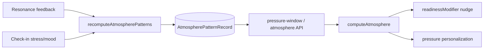

# Pattern Store — Storage Decision

**Date:** 2026-06-26  
**Status:** Accepted  
**Scope:** Phase 7b — recurring transit sensitivity tags

## Decision

Use **Prisma + SQLite JSON fields** (`AtmospherePatternRecord.tagsJson`) for the MVP pattern store.

**Do not** adopt pgvector in this phase.

## Options considered

| Option | Pros | Cons | Verdict |
|--------|------|------|---------|
| **Prisma row per pattern key** | Queryable, fits existing resonance tables, works on SQLite | Needs migration | **Selected** |
| **JSON blob on `UserContextSnapshot`** | No new table | Hard to query/update atomically, merge conflicts | Rejected for primary store |
| **pgvector** | Semantic recall for journal text | Requires Postgres + embedding pipeline; Merlin dev DB is SQLite | **Deferred** |

## Rationale

1. Merlin's local dev database is **SQLite** (`prisma/schema.prisma`). pgvector is not available without a Postgres migration and embedding service.
2. Transit sensitivity patterns are **structured keys** (`planet:Mars`, `transit:Mars:Square:Moon`), not semantic vectors. Tabular storage is sufficient.
3. The project already learns from thumbs via `ResonanceFeedbackRecord` and `PersonalResonanceRecord`. The atmosphere pattern store **aggregates** those signals into atmosphere-specific tags without replacing resonance DB.
4. Journal / behavior patterns (from `pattern-mirror.ts`) remain separate. Vector search for free-text recall is a **future** upgrade when Postgres + opt-in embedding UX exist.

## Schema

```prisma
model AtmospherePatternRecord {
  id               String   @id @default(cuid())
  userId           String
  patternKey       String   // planet:Mars | transit:Mars:Square:Moon
  patternType      String   // planet | transit
  sensitivityScore Float    // -1..1 (negative = dampens felt load)
  sampleCount      Int      @default(0)
  confidence       Float    @default(0.5)
  tagsJson         String?  // ["emotional_reactivity","work_pressure"]
  lastSeenAt       DateTime?
  updatedAt        DateTime @updatedAt

  @@unique([userId, patternKey])
  @@index([userId, patternType])
}
```

## Data flow



## Future path to vectors

When biometrics + journal volume justify it:

1. Migrate production DB to Postgres
2. Add optional `AtmosphereMemoryEmbedding` table with pgvector
3. Keep `AtmospherePatternRecord` for deterministic transit keys; use vectors only for fuzzy journal recall

## Apply migration locally

```bash
npx prisma db push
npx prisma generate
```